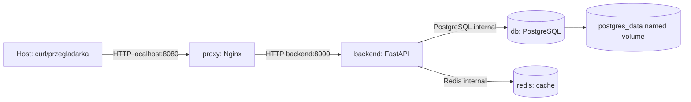

# CHECKLIST - projekt Docker

## 1. Uruchomienie od zera

Wymagania lokalne:

- Docker Desktop albo Docker Engine z pluginem Docker Compose
- wolny port `8080` na hoście

Kroki:

```powershell
Copy-Item .env.example .env -Force
docker compose --env-file .env config
docker compose --env-file .env up -d --build
docker compose --env-file .env ps
```

Oczekiwane: usługi `proxy`, `backend`, `db` i `redis` mają status `running` oraz healthcheck `healthy`.

Zatrzymanie projektu:

```powershell
docker compose --env-file .env down
```

Usuniecie danych bazy, tylko gdy naprawdę chcesz wyczyścić projekt:

```powershell
docker compose --env-file .env down -v
```

## 2. Diagram architektury



Sieci:

- `public` - ruch z hosta do `proxy`
- `internal` - komunikacja między `proxy`, `backend`, `db` i `redis`

Baza danych i Redis nie mają portów wystawionych na hosta.

## 3. Lista usług i portów

| Usluga | Obraz | Sieci | Porty na hoście | Healthcheck |
| --- | --- | --- | --- | --- |
| `proxy` | `nginx:1.27-alpine` | `public`, `internal` | `8080 -> 80` | `wget /health` |
| `backend` | `projekt-docker-backend:1.0.0` | `internal` | brak | HTTP `/health` |
| `db` | `postgres:16-alpine` | `internal` | brak | `pg_isready` |
| `redis` | `redis:7-alpine` | `internal` | brak | `redis-cli ping` |

## 4. Komendy testowe aplikacji

W PowerShell przy `curl.exe` używam `--%`, żeby Windows nie popsuł cudzysłowów w JSON-ie.

Healthcheck API:

```powershell
curl.exe http://localhost:8080/health
```

Przykładowy wynik:

```json
{"api":"ok","database":"ok","redis":"ok"}
```

Dodanie zadania:

```powershell
curl.exe --% -i -X POST http://localhost:8080/tasks -H "Content-Type: application/json" -d "{\"title\":\"Zaliczenie Docker\"}"
```

Przykładowy wynik:

```http
HTTP/1.1 201 Created
Content-Type: application/json

{"id":1,"title":"Zaliczenie Docker","done":false,"created_at":"2026-05-31T20:30:00+00:00"}
```

Pierwszy odczyt listy zadań:

```powershell
curl.exe -i http://localhost:8080/tasks
```

Przykładowy wynik:

```http
HTTP/1.1 200 OK
X-Cache: MISS
Content-Type: application/json

{"items":[{"id":1,"title":"Zaliczenie Docker","done":false,"created_at":"2026-05-31T20:30:00+00:00"}],"count":1}
```

Drugi odczyt listy zadań:

```powershell
curl.exe -i http://localhost:8080/tasks
```

Przykładowy wynik zawiera:

```http
X-Cache: HIT
```

To jest dowód działania Redis jako cache.

## 5. Trwałość danych

Test trwałości danych bez usuwania wolumenu:

```powershell
curl.exe --% -i -X POST http://localhost:8080/tasks -H "Content-Type: application/json" -d "{\"title\":\"Dane po restarcie\"}"
docker compose --env-file .env down
docker compose --env-file .env up -d
curl.exe http://localhost:8080/tasks
```

Oczekiwane: rekord `Dane po restarcie` nadal jest widoczny. Dane są zapisane w named volume `postgres_data`.

Sprawdzenie wolumenu:

```powershell
docker volume ls
```

Oczekiwany wpis zawiera nazwę podobną do:

```text
projekt-docker-cloud_postgres_data
```

## 6. Sprawdzenie Docker Compose

Walidacja konfiguracji:

```powershell
docker compose --env-file .env config
```

Status kontenerów:

```powershell
docker compose --env-file .env ps
```

Logi backendu:

```powershell
docker compose --env-file .env logs backend
```

Logi Redis:

```powershell
docker compose --env-file .env logs redis
```

## 7. Sekrety i konfiguracja

Projekt zawiera `.env.example` z konfiguracją niepoufną. Hasło do PostgreSQL jest przekazywane przez Docker Compose secret:

```yaml
secrets:
  db_password:
    file: ${DB_PASSWORD_FILE:-./secrets/db_password.txt.example}
```

Na potrzeby szybkiego sprawdzenia domyślnie używany jest plik `secrets/db_password.txt.example`. W realnym scenariuszu należy utworzyć prywatny plik, np. `secrets/db_password.txt`, i ustawić w `.env`:

```env
DB_PASSWORD_FILE=./secrets/db_password.txt
```

Plik `secrets/db_password.txt` jest wpisany do `.gitignore`.

## 8. Wymagania wykonane

| Wymaganie | Status | Gdzie sprawdzić |
| --- | --- | --- |
| Minimum 4 usługi w Docker Compose | wykonane | `docker-compose.yml` |
| Backend budowany z własnego Dockerfile | wykonane | `backend/Dockerfile` |
| Multi-stage build | wykonane | `backend/Dockerfile` |
| Aplikacja nie działa jako root | wykonane | `USER app` w `backend/Dockerfile` |
| `.dockerignore` | wykonane | `backend/.dockerignore` |
| Reverse proxy | wykonane | `proxy` + `nginx/default.conf` |
| Osobne sieci zewnętrzna i wewnętrzna | wykonane | `public`, `internal` |
| Baza bez portu na hosta | wykonane | brak `ports` w usłudze `db` |
| Named volume dla bazy danych | wykonane | `postgres_data` |
| `.env.example` | wykonane | `.env.example` |
| Docker Compose secrets | wykonane | `secrets.db_password` |
| Healthchecki | wykonane | `backend`, `db`, `redis`, dodatkowo `proxy` |
| Zależności startu usług | wykonane | `depends_on.condition: service_healthy` |
| Minimalna funkcjonalność | wykonane | `POST /tasks`, `GET /tasks`, `GET /health` |
| Trwałość danych po `down` i `up` | wykonane | named volume PostgreSQL |
| Cache albo worker | wykonane | Redis, nagłówek `X-Cache` |
| Tagowanie obrazu aplikacyjnego | wykonane | `projekt-docker-backend:${APP_VERSION:-1.0.0}` |

## 9. Szybka lista ocenianych plików

- `docker-compose.yml`
- `.env.example`
- `backend/Dockerfile`
- `backend/.dockerignore`
- `backend/app/main.py`
- `nginx/default.conf`
- `secrets/db_password.txt.example`
- `README.md`
- `CHECKLIST.md`
