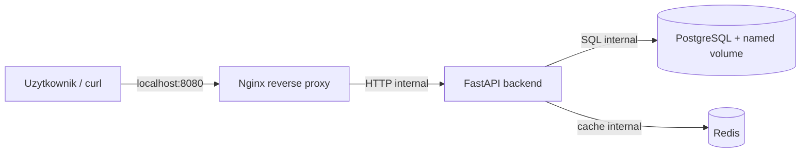

# Projekt Docker - aplikacja wieloserwisowa

Mala aplikacja wieloserwisowa do zaliczenia z technologii chmurowych. Funkcjonalnosc jest celowo prosta: API pozwala dodawac i odczytywac zadania. Najwazniejsza czesc projektu to architektura uruchomieniowa w Docker Compose.

## Architektura



Usługi:

| Usluga | Rola | Dostep z hosta |
| --- | --- | --- |
| `proxy` | Nginx reverse proxy | `localhost:8080` |
| `backend` | FastAPI, endpointy `/health`, `/tasks` | brak, tylko przez proxy |
| `db` | PostgreSQL | brak wystawionego portu |
| `redis` | cache dla listy zadan | brak wystawionego portu |

## Szybkie uruchomienie

```powershell
Copy-Item .env.example .env -Force
docker compose --env-file .env up -d --build
docker compose --env-file .env ps
```

Sprawdzenie:

```powershell
curl.exe http://localhost:8080/health
curl.exe --% -i -X POST http://localhost:8080/tasks -H "Content-Type: application/json" -d "{\"title\":\"Zaliczenie Docker\"}"
curl.exe -i http://localhost:8080/tasks
curl.exe -i http://localhost:8080/tasks
```

Drugi odczyt `/tasks` powinien zwrocic naglowek:

```text
X-Cache: HIT
```

Pelna instrukcja sprawdzania jest w [CHECKLIST.md](CHECKLIST.md).
